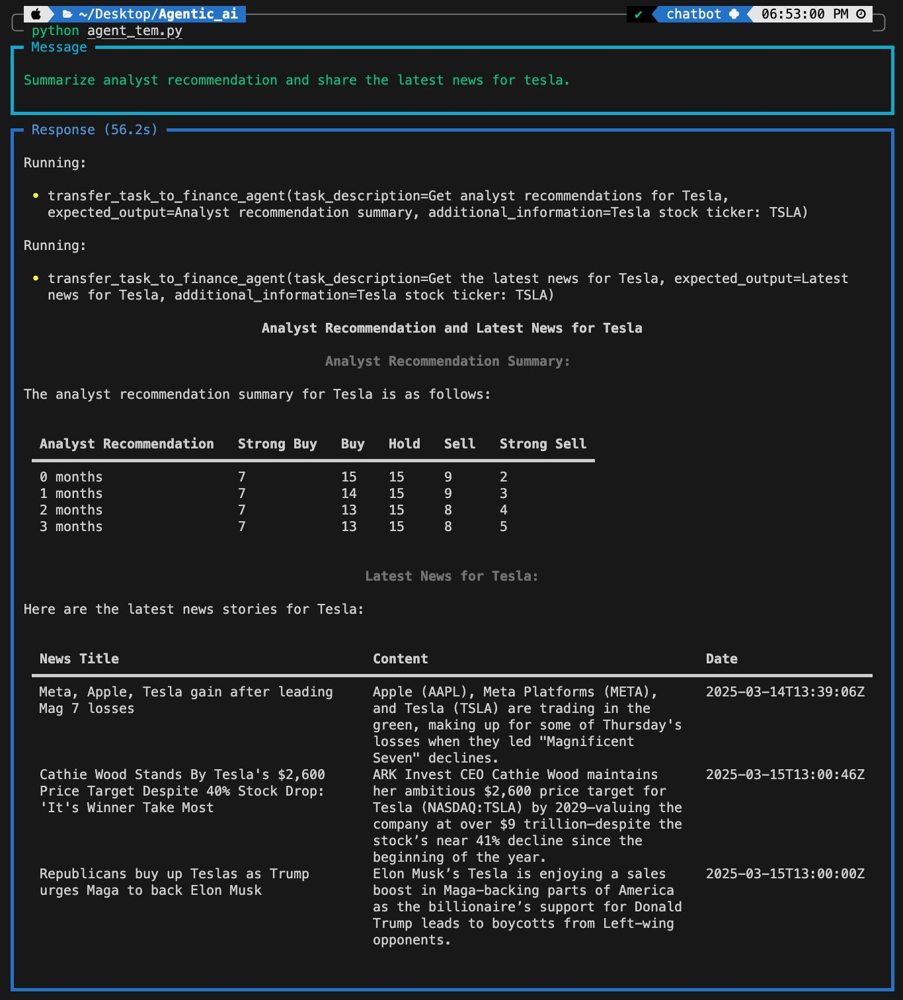

# Work Flow


Above image is work flow of Agentic AI solution designed to build a Finance Chatbot using the Phidata framework and open-source LLMs deployed on Groq. The chatbot leverages tools like DuckDuckGo for web search and YFinance for real-time financial data. It uses multiple agents, including a Web Agent for fetching up-to-date information and a Finance Agent for retrieving stock market insights, analyst recommendations, and financial news. 
* Models: llama-3.1-8b-instan with CONTEXT WINDOW - 128K and deepseek-r1-distill-llama-70b with CONTEXT WINDOW - 128K.

# Steps to run the Agent 
  ## Step 1: setup the environment 💻
```bash
git clone https://github.com/Abhijit7979/Agentic-Ai.git
conda env create -f env.yml  
conda activate AgenticAI  
```
  ##  Step 1.2: setup the API keys 💻
  create .env file add Api keys of phidata , groq, openai
```bash
GROQ_API_KEY="API_key"
PHI_API_KEY ="API_key"
OPENAI_API_KEY="API_key"
```

  ##  Step 2: navigate to Agent_team.py 🏃‍♂️
```bash
cd Agentic-Ai/src
python Agent_team.py
```
##  Step 3:  give user prompt 




## Tools (phi data) 
- YFinanceTools enable an Agent to access stock data, financial information and more from Yahoo Finance.
- DuckDuckGo enables an Agent to search the web for information.
- DuckDbTools enable an Agent to run SQL and analyze data using DuckDb.
- WebsiteTools enable an Agent to parse a website and add its contents to the knowledge base.


## Agents 
- Data analyst :  The user give .csv file as input and  using  DuckDbTool to store the data in SQL format and query the data.


- web agent :  This agent summarize the website given by the user using the tool WebsiteTools.


## Agent Function 
```bash
from phi.agent import Agent
from phi.model.groq import Groq

agent = Agent(
    name="Agent name"
    model=Groq(id="model_name"),
    tools=[],
    description="",
    instructions=[],
    markdown=True,
    show_tool_calls=True,
    add_datetime_to_instructions=True,
    # debug_mode=True,
)
```
- model -->  We can use  llm models from platforms like openai ,aws ,Groq 
- tools --> Tools are functions the model may generate JSON inputs for.
- description ,instructions -->  instruction prompts to the model.
- show_tool_calls --> Print the signature of the tool calls in the Model response.

## Create custom tools
```bash
def get_company_symbol(company:str)-> str:
    '''use this fuction to get the symbol for a company.
    Args:
        company (str): The name of the comapny.

    Returns: 
        str : the symbol for the company.
    '''
    company=company.lower()
    symbols= {
        "infosys":"INFY",
        "tesla":"TSLA",
        "apple":"AAPL",
        "microsoft":"MSFT",
        "google":"GOOGL",
    }
    return symbols.get(company,"Unknown")
```
To create a custom tool, consider the implementation of YFinanceTool in the Agent_team.py file as an example. This tool retrieves stock information, but it requires the correct stock symbol. If a user provides a company name instead of a symbol, the get_company_symbol function converts the name into its corresponding stock symbol and passes it to YFinanceTool for further processing.
When developing a custom tool, it is essential to include a docstring within the function. The docstring should clearly describe the tool’s functionality. Based on the Docstring the llm present in the agent decides to use the tool or not.
